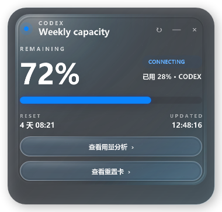
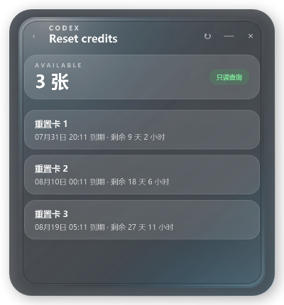

<p align="center">
  
</p>

<h1 align="center">Codex Quota Orb</h1>

<p align="center"><strong>A native Windows floating orb for live Codex quota, daily token trends, and local Skill/Agent analytics.</strong></p>

<p align="center">
  
</p>

Codex Quota Orb is a lightweight, local-first Windows widget. Its liquid orb shows the remaining Codex weekly quota at a glance; click it to open quota details and local usage analytics.

> [!NOTE]
> Community project. Not affiliated with or endorsed by OpenAI. Codex interfaces can change, so a future Codex update may require a widget update.

## Latest update

| Updated | Version | Categories |
| --- | --- | --- |
| 2026-07-23 | 1.3.0 | Appearance · Codex compatibility · Distribution |

- **Appearance:** added an optional six-stage blue-to-orange quota gradient with adaptive number contrast.
- **Codex compatibility:** recognizes both standalone Codex executables and npm-installed layouts.
- **Distribution:** keeps the original Classic style as the default and publishes separate Classic and Gradient packages.

## Choose your orb style

| Classic — original | Gradient — new |
| --- | --- |
|  |  |
| The familiar non-gradient liquid orb from earlier releases. It remains the default. | Changes continuously through six anchors: blue, sky blue, teal, gold, amber, and orange. Exposed numbers adapt for contrast. |

Both styles have the same quota, Reset Credits, analytics, privacy, and tray features. Re-run either explicit install command at any time to switch styles without removing usage history. Later default updates preserve the style you already selected.

## Highlights

- Live weekly quota from the local Codex app server, with session-event fallback.
- Read-only Reset Credits count and per-card expiry times, with no redeem or purchase action.
- Daily account token trends when the account usage interface is available.
- Installed-Skill inventory, terminal-Skill attribution, ordered route chains, and Agent attribution.
- Floating liquid-glass orb, expandable panel, drag support, and system tray controls.
- No telemetry, ads, analytics service, or model calls.
- Runs as native PowerShell/WPF; Python is only needed for the optional analytics page.

## Read-only Reset Credits

<p align="center">
  
</p>

- Opens as a separate liquid-glass page from the quota details view.
- Shows the available card count plus each card's local expiry time and remaining lifetime.
- Numbers cards and sorts them by the earliest expiry time.
- Queries once when the page opens; its refresh button only re-reads Reset Credits and does not refresh weekly quota.
- Provides explicit empty and retry states, with no redeem, reset, purchase, or top-up action.

## Install

### Classic style — original and default

Open PowerShell and run:

```powershell
irm https://raw.githubusercontent.com/CW12138/codex-quota-orb/main/Install.ps1 | iex
```

You can also select it explicitly:

```powershell
& ([scriptblock]::Create((irm 'https://raw.githubusercontent.com/CW12138/codex-quota-orb/main/Install.ps1'))) -OrbStyle Classic
```

### Gradient style — blue to orange

```powershell
& ([scriptblock]::Create((irm 'https://raw.githubusercontent.com/CW12138/codex-quota-orb/main/Install.ps1'))) -OrbStyle Gradient
```

The installer downloads this repository, copies the runtime files to `%LOCALAPPDATA%\Programs\CodexQuotaOrb`, adds a Start Menu shortcut, enables launch detection for interactive `codex` sessions, and starts the widget. It does not require administrator rights.

Prefer to inspect scripts before running them? Download or clone the repository, review `Install.ps1`, and then double-click `Install.cmd`.

GitHub Releases also provides two portable packages: `Classic.zip` and `Gradient.zip`. The previous `v1.2.0` release and its original package remain unchanged.

### Requirements

- Windows 10 or Windows 11.
- Codex CLI installed and signed in.
- Windows PowerShell 5.1 or later.
- Python 3.10+ on `PATH` for the 7-day, Skill, and Agent analytics pages. The quota orb works without Python.

## Use

- Click the orb to expand quota details.
- Select **View reset credits** to query the available count and expiry time of each card.
- Drag the orb to move it.
- Select **View usage analytics** for 7-day, Skill, and Agent views.
- Use **—** to collapse back to the orb.
- Use the system tray icon to open, refresh, or exit.

To start it manually, open **Codex Quota Orb** from the Start Menu or run:

```powershell
powershell -NoProfile -ExecutionPolicy Bypass -File .\CodexRateWidget.ps1 -OrbStyle Classic
powershell -NoProfile -ExecutionPolicy Bypass -File .\CodexRateWidget.ps1 -OrbStyle Gradient
```

## What the numbers mean

- **Weekly quota** comes from `account/rateLimits/read` when available. It is not estimated from raw tokens.
- **Reset Credits** are queried on demand from the official account service and sorted by the earliest expiry time. The widget never redeems a card.
- **Daily tokens** come from `account/usage/read.dailyUsageBuckets` when available, with local session-event fallback.
- **Installed Skills** are discovered from the local user Skill directory and remain visible even when their current value is zero.
- **Primary Skill tokens** assign each attributed Turn once to the terminal observed Skill, so the primary total remains additive.
- **Associated tokens** show every Skill involved in that Turn. They are intentionally non-additive and can sum beyond the local total.
- **Route chains** preserve short evidence order such as `task-router → data-analysis`. Skill roles are inferred from their position in the observed chain rather than from personalized names. Bulk Skill catalogs are rejected as attribution evidence, and unattributed Turns remain explicit in the coverage figure.
- **Agent attribution** uses local thread metadata and always keeps the main Agent separate.
- Account-level daily usage may include other Codex surfaces or devices. Local Skill/Agent data only covers sessions found on this computer, so the two views intentionally use different denominators.

## Privacy

Codex Quota Orb is local-first:

- It reads quota through the locally installed Codex app server, reads local Codex session files for fallback and attribution, and makes a read-only Reset Credits lookup when that page is opened.
- It uses the local Codex ChatGPT login token only in memory for that lookup; it never displays, stores, copies, or logs the token.
- It sends no widget telemetry and makes no model-generation requests.
- Runtime data stays under `%LOCALAPPDATA%\CodexRateWidget`.

See [PRIVACY.md](PRIVACY.md) for the exact data boundary.

## Uninstall

Open **Uninstall Codex Quota Orb** from the Start Menu, or run the installed `Uninstall.cmd`. Usage history is kept by default. To remove local widget data as well:

```powershell
powershell -NoProfile -ExecutionPolicy Bypass -File "$env:LOCALAPPDATA\Programs\CodexQuotaOrb\Uninstall.ps1" -RemoveData
```

## Development

Run a non-account UI render:

```powershell
powershell -NoProfile -ExecutionPolicy Bypass -File .\CodexRateWidget.ps1 `
  -QARenderPath .\preview.png -QAView capacity -QARemaining 64
```

Run the headless probe and Python syntax check:

```powershell
powershell -NoProfile -ExecutionPolicy Bypass -File .\CodexRateWidget.ps1 -HeadlessProbe
python -m py_compile .\UsageAnalytics.py
```

## 中文说明

Codex Quota Orb 是一个 Windows 原生、本地优先的 Codex 额度悬浮窗。水球显示周额度剩余百分比，点击后可查看额度详情、重置卡余量与到期时间、近 7 日 Token，以及本机 Skill/Agent 归因统计。

- **2026-07-23 更新（v1.3.0）：** 新增可选的蓝色到橙色六段渐变主题、适配新版独立 Codex 可执行文件，并分别提供经典版与渐变版发布包。
- **经典版：** 保留此前的非渐变水球并继续作为默认选择。
- **渐变版：** 额度从 100% 到 0% 依次经过蓝、天蓝、青绿、金、琥珀、橙色；低额度时露出区域的数字自动改用深灰蓝色。
- 一行命令安装，无需管理员权限。
- 主额度页不依赖 Python；统计页需要 Python 3.10+。
- 不上传会话内容，不保存、显示或记录访问令牌，不调用模型生成。
- 重置卡页面只查询可用张数和到期时间，不提供使用重置卡或充值入口。
- Skill 页会列出本机已安装 Skill，包括当前为 0 的条目；“主归因 Token”只计最终 Skill，“关联 Token”不可相加。
- 路由链按证据顺序显示，例如 `task-router → data-analysis`；角色由调用链中的位置判断，不依赖个人化 Skill 名称，批量 Skill 清单也不会被误判成全部调用。
- 本地归因是透明的辅助统计，不伪装成官方精确计费。

## License

[MIT](LICENSE)
