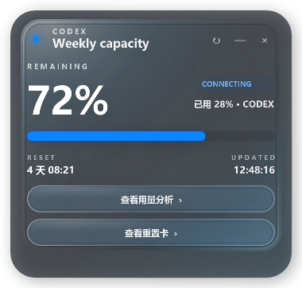
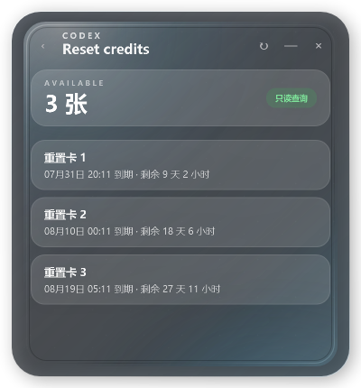

<p align="center">
  
</p>

<h1 align="center">Codex Quota Orb</h1>

<p align="center"><strong>A native Windows floating orb for live Codex quota, daily token trends, and zero-Token local workflow analytics.</strong></p>

<p align="center">
  
</p>

Codex Quota Orb is a lightweight, local-first Windows widget. Its liquid orb is reserved for the Codex 5-hour quota; while that window is unavailable, it safely mirrors the current weekly quota. Click it to open separate 5-hour and 1-week quota modules plus local usage analytics.

> [!NOTE]
> Community project. Not affiliated with or endorsed by OpenAI. Codex interfaces can change, so a future Codex update may require a widget update.

## Latest update

| Updated | Version | Categories |
| --- | --- | --- |
| 2026-08-26 | 1.4.0 | Quota-first UI · Skill/Agent/Tool analytics · 0 Token |

- **Complete Skill view:** separates locally installed Skills from the latest available-Skill catalog observed in Codex sessions, including system and plugin scopes.
- **Repeated attribution:** gives every participating Skill the Turn's Token total while keeping unique coverage and terminal-Skill attribution available as separate fields.
- **Simple workflow detail:** keeps quota and Token first, then shows readable Skill status, Agent completion/activity, and all locally recorded Tool categories. MCP is treated as one Tool category instead of a separate technical page.

## Choose your orb style

| Classic — original | Gradient — new |
| --- | --- |
|  |  |
| The familiar non-gradient liquid orb from earlier releases. It remains the default. | Changes continuously through six anchors: blue, sky blue, teal, gold, amber, and orange. Exposed numbers adapt for contrast. |

Both styles have the same quota, Reset Credits, analytics, privacy, and tray features. Re-run either explicit install command at any time to switch styles without removing usage history. Later default updates preserve the style you already selected.

## Highlights

- Live 5-hour and 1-week quota from the local Codex app server, with a weekly mirror while the 5-hour window is unavailable.
- Read-only Reset Credits count and per-card expiry times, with no redeem or purchase action.
- Daily account token trends when the account usage interface is available.
- Installed/available Skill inventory, repeated participating attribution, multi-Skill chains, Agent hierarchy, and Tool analytics.
- Floating liquid-glass orb, expandable panel, drag support, and system tray controls.
- No telemetry, ads, analytics service, or model calls; the widget itself consumes 0 model Tokens.
- Runs as native PowerShell/WPF; Python is only needed for the optional analytics page.

## Read-only Reset Credits

<p align="center">
  
</p>

- Opens as a separate liquid-glass page from the quota details view.
- Shows the available card count plus each card's local expiry time and remaining lifetime.
- Numbers cards and sorts them by the earliest expiry time.
- Queries once when the page opens; its refresh button only updates the Reset Credits page and does not replace the displayed quota snapshot.
- Provides explicit empty and retry states, with no redeem, reset, purchase, or top-up action.

## Install

### Classic style — original and default

Open PowerShell and run:

```powershell
irm https://raw.githubusercontent.com/CW12138/codex-quota-orb/main/Install.ps1 | iex
```

You can also select it explicitly:

```powershell
& ([scriptblock]::Create((irm 'https://raw.githubusercontent.com/CW12138/codex-quota-orb/main/Install.ps1'))) -OrbStyle Classic
```

### Gradient style — blue to orange

```powershell
& ([scriptblock]::Create((irm 'https://raw.githubusercontent.com/CW12138/codex-quota-orb/main/Install.ps1'))) -OrbStyle Gradient
```

The installer downloads this repository, copies the runtime files to `%LOCALAPPDATA%\Programs\CodexQuotaOrb`, adds a Start Menu shortcut, enables launch detection for interactive `codex` sessions, and starts the widget. It does not require administrator rights.

Prefer to inspect scripts before running them? Download or clone the repository, review `Install.ps1`, and then double-click `Install.cmd`.

GitHub Releases also provides two portable packages: `Classic.zip` and `Gradient.zip`. The previous `v1.2.0` release and its original package remain unchanged.

### Requirements

- Windows 10 or Windows 11.
- Codex CLI installed and signed in.
- Windows PowerShell 5.1 or later.
- Python 3.10+ on `PATH` for the Token, Skill, Agent, and Tool analytics pages. The quota orb works without Python.

## Use

- Click the orb to expand quota details.
- Select **View reset credits** to query the available count and expiry time of each card.
- Drag the orb to move it.
- Select **View usage analytics** for Token, Skill, Agent, and Tool views.
- Use **—** to collapse back to the orb.
- Use the system tray icon to open, refresh, or exit.

To start it manually, open **Codex Quota Orb** from the Start Menu or run:

```powershell
powershell -NoProfile -ExecutionPolicy Bypass -File .\CodexRateWidget.ps1 -OrbStyle Classic
powershell -NoProfile -ExecutionPolicy Bypass -File .\CodexRateWidget.ps1 -OrbStyle Gradient
```

## What the numbers mean

- **5-hour and 1-week quota** come from the `primary`/`secondary` windows returned by `account/rateLimits/read` and are classified by `windowDurationMins`, not by response order. If no 5-hour window is present, the 5-hour slot mirrors the authoritative weekly value until the service restores it.
- **Compact orb** intentionally shows only the percentage. It represents the 5-hour slot; during the temporary weekly fallback, that percentage is the mirrored weekly value.
- **Reset times** come from each selected window's own `resetsAt`; they are not shared after a real 5-hour window returns.
- **Reset Credits** come from `account/rateLimits/read.rateLimitResetCredits` on demand and are sorted by the earliest available expiry time. `availableCount` remains authoritative when detail rows are omitted or capped. The widget never redeems a card.
- **Daily tokens** come from `account/usage/read.dailyUsageBuckets` when available, with local session-event fallback.
- **Installed Skills** combine personal Skill folders with file-backed entries in the latest locally observed Codex Skill catalog. **Available Skills** are the entries Codex advertised in that catalog; the two counts can differ when the catalog is context-budgeted or a local Skill was not advertised in that session.
- **Participating Skill tokens** give the full Turn total to every observed Skill in that Turn. They intentionally repeat and can sum beyond the local total.
- **Primary Skill tokens** remain available as an exclusive secondary field assigned to the terminal observed Skill. **Attribution coverage** still counts each Turn only once.
- **Multi-Skill call chains** preserve observed evidence order such as `task-router → data-analysis`. Single-Skill Turns do not appear in the chain view.
- **Agent attribution** expands root threads by project and subagent threads by role, with completed Turns, Tool activity, recent use, local raw Token, model, and reasoning-effort metadata. It does not claim to split the official quota percentage by Agent.
- **Tool analytics** groups already-recorded commands, file edits, web queries, Agent coordination, media, documents, workflow controls, and MCP/connectors into readable categories. Raw names remain available in tooltips.
- **Workflow hints** use at most three deterministic local rules. They are not generated by a model.
- Account-level daily usage may include other Codex surfaces or devices. Local Skill/Agent/Tool data only covers sessions found on this computer, so the views intentionally use different denominators.

## Privacy

Codex Quota Orb is local-first:

- It reads quota, account usage, and Reset Credits through the locally installed Codex app server, and reads local Codex session files for fallback and attribution.
- It does not read `auth.json`, handle the Codex ChatGPT access token, or call an internal ChatGPT backend endpoint.
- It sends no widget telemetry and makes no model-generation requests.
- Runtime data stays under `%LOCALAPPDATA%\CodexRateWidget`.

See [PRIVACY.md](PRIVACY.md) for the exact data boundary.

## Uninstall

Open **Uninstall Codex Quota Orb** from the Start Menu, or run the installed `Uninstall.cmd`. Usage history is kept by default. To remove local widget data as well:

```powershell
powershell -NoProfile -ExecutionPolicy Bypass -File "$env:LOCALAPPDATA\Programs\CodexQuotaOrb\Uninstall.ps1" -RemoveData
```

## Development

Run a non-account UI render:

```powershell
powershell -NoProfile -ExecutionPolicy Bypass -File .\CodexRateWidget.ps1 `
  -QARenderPath .\preview.png -QAView capacity -QARemaining 64
```

Run the headless probe and Python syntax check:

```powershell
powershell -NoProfile -ExecutionPolicy Bypass -File .\CodexRateWidget.ps1 -HeadlessProbe
python -m py_compile .\UsageAnalytics.py
```

## 中文说明

Codex Quota Orb 是一个 Windows 原生、本地优先的 Codex 额度悬浮窗。最小水球固定用于显示 5 小时额度；当前服务尚未提供 5 小时窗口时，会安全回退为周额度。点击后可分别查看 5 小时与 1 周额度、各自重置时间、重置卡余量与到期时间、近 7 日 Token，以及本机 Skill/Agent 归因统计。

- **2026-08-26 更新（v1.4.0）：** 额度与 Token 保持第一优先；Skill 页显示常用、偶尔使用、未使用和最近使用时间；Agent 页显示完成情况与 Tool 活动；Tool 页统一展示命令、文件、网页、Agent、媒体和 MCP/连接器调用。
- **经典版：** 保留此前的非渐变水球并继续作为默认选择。
- **渐变版：** 额度从 100% 到 0% 依次经过蓝、天蓝、青绿、金、琥珀、橙色；低额度时露出区域的数字自动改用深灰蓝色。
- 一行命令安装，无需管理员权限。
- 主额度页不依赖 Python；统计页需要 Python 3.10+。
- 不上传会话内容，不保存、显示或记录访问令牌，不调用模型生成；悬浮球自身保持 0 Token 消耗。
- 重置卡页面只查询可用张数和到期时间，不提供使用重置卡或充值入口。
- Skill 页会列出本机已安装及当前会话公布的 Skill，包括当前为 0 的条目；默认“参与 Token”会对涉及的每个 Skill 重复计算，唯一覆盖率仍按 Turn 只计一次。
- 多 Skill 调用链按本地载入证据顺序显示，例如 `task-router → data-analysis`；它作为组合详情，不宣称文件读取顺序就是业务路由因果关系。
- Agent 页显示主 Agent 项目分组、子 Agent 角色、完成 Turn 和 Tool 活动；Tool 页只读取已有本地记录，不主动连接服务器，也不调用模型。
- 本地归因是透明的辅助统计，不伪装成官方精确计费。

## License

[MIT](LICENSE)
